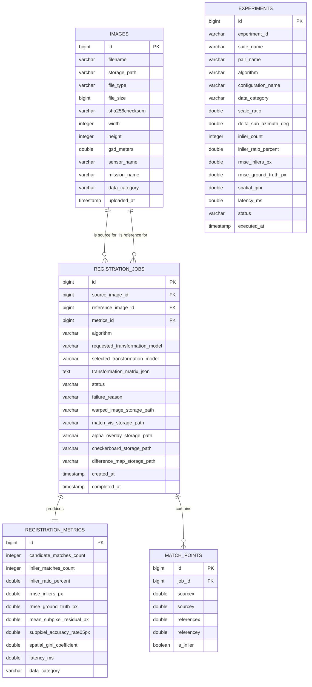

# SIH 2026 (SIH26166) — MySQL Database Schema Specification

**Database Engine**: MySQL 8.0 / InnoDB  
**Schema Name**: `lunar_registration_db`  
**ORM Framework**: Spring Data JPA / Hibernate 6  

---

## 1. Entity-Relationship Diagram (ERD)



---

## 2. Table DDL Definitions

```sql
CREATE DATABASE IF NOT EXISTS lunar_registration_db CHARACTER SET utf8mb4 COLLATE utf8mb4_unicode_ci;
USE lunar_registration_db;

-- 1. Images Table
CREATE TABLE IF NOT EXISTS images (
    id BIGINT AUTO_INCREMENT PRIMARY KEY,
    filename VARCHAR(255) NOT NULL,
    storage_path VARCHAR(255) NOT NULL,
    file_type VARCHAR(255) NOT NULL,
    file_size BIGINT NOT NULL,
    sha256checksum VARCHAR(64) NOT NULL,
    width INT,
    height INT,
    gsd_meters DOUBLE,
    sensor_name VARCHAR(255),
    mission_name VARCHAR(255),
    data_category VARCHAR(255) NOT NULL DEFAULT 'SYNTHETIC_BENCHMARK',
    uploaded_at TIMESTAMP NOT NULL DEFAULT CURRENT_TIMESTAMP,
    INDEX idx_images_sha256 (sha256checksum),
    INDEX idx_images_category (data_category)
) ENGINE=InnoDB;

-- 2. Registration Metrics Table
CREATE TABLE IF NOT EXISTS registration_metrics (
    id BIGINT AUTO_INCREMENT PRIMARY KEY,
    candidate_matches_count INT,
    inlier_matches_count INT,
    inlier_ratio_percent DOUBLE,
    rmse_inliers_px DOUBLE,
    rmse_ground_truth_px DOUBLE,
    mean_subpixel_residual_px DOUBLE,
    subpixel_accuracy_rate05px DOUBLE,
    spatial_gini_coefficient DOUBLE,
    latency_ms DOUBLE,
    data_category VARCHAR(255) NOT NULL DEFAULT 'SYNTHETIC_BENCHMARK'
) ENGINE=InnoDB;

-- 3. Registration Jobs Table
CREATE TABLE IF NOT EXISTS registration_jobs (
    id BIGINT AUTO_INCREMENT PRIMARY KEY,
    source_image_id BIGINT NOT NULL,
    reference_image_id BIGINT NOT NULL,
    metrics_id BIGINT UNIQUE,
    algorithm VARCHAR(255) NOT NULL,
    requested_transformation_model VARCHAR(255) NOT NULL,
    selected_transformation_model VARCHAR(255),
    transformation_matrix_json TEXT,
    status VARCHAR(255) NOT NULL,
    failure_reason VARCHAR(255),
    warped_image_storage_path VARCHAR(255),
    match_vis_storage_path VARCHAR(255),
    alpha_overlay_storage_path VARCHAR(255),
    checkerboard_storage_path VARCHAR(255),
    difference_map_storage_path VARCHAR(255),
    created_at TIMESTAMP NOT NULL DEFAULT CURRENT_TIMESTAMP,
    completed_at TIMESTAMP NULL,
    CONSTRAINT fk_jobs_src_img FOREIGN KEY (source_image_id) REFERENCES images(id),
    CONSTRAINT fk_jobs_ref_img FOREIGN KEY (reference_image_id) REFERENCES images(id),
    CONSTRAINT fk_jobs_metrics FOREIGN KEY (metrics_id) REFERENCES registration_metrics(id),
    INDEX idx_jobs_status (status),
    INDEX idx_jobs_created_at (created_at DESC)
) ENGINE=InnoDB;

-- 4. Match Points Table
CREATE TABLE IF NOT EXISTS match_points (
    id BIGINT AUTO_INCREMENT PRIMARY KEY,
    job_id BIGINT NOT NULL,
    sourcex DOUBLE NOT NULL,
    sourcey DOUBLE NOT NULL,
    referencex DOUBLE NOT NULL,
    referencey DOUBLE NOT NULL,
    is_inlier BOOLEAN NOT NULL,
    CONSTRAINT fk_match_points_job FOREIGN KEY (job_id) REFERENCES registration_jobs(id) ON DELETE CASCADE,
    INDEX idx_points_job (job_id)
) ENGINE=InnoDB;

-- 5. Experiments Table
CREATE TABLE IF NOT EXISTS experiments (
    id BIGINT AUTO_INCREMENT PRIMARY KEY,
    experiment_id VARCHAR(255) NOT NULL,
    suite_name VARCHAR(255) NOT NULL,
    pair_name VARCHAR(255) NOT NULL,
    algorithm VARCHAR(255) NOT NULL,
    configuration_name VARCHAR(255),
    data_category VARCHAR(255) NOT NULL DEFAULT 'SYNTHETIC_BENCHMARK',
    scale_ratio DOUBLE,
    delta_sun_azimuth_deg DOUBLE,
    inlier_count INT,
    inlier_ratio_percent DOUBLE,
    rmse_inliers_px DOUBLE,
    rmse_ground_truth_px DOUBLE,
    spatial_gini DOUBLE,
    latency_ms DOUBLE,
    status VARCHAR(255) NOT NULL,
    executed_at TIMESTAMP NOT NULL DEFAULT CURRENT_TIMESTAMP,
    INDEX idx_experiments_suite (suite_name),
    INDEX idx_experiments_algo (algorithm)
) ENGINE=InnoDB;
```
