# SIH26166: Core Workflow Diagram & Scientific Registration Architecture

## 1. Official SIH26166 Problem Statement (Source of Truth)

"Background Image Registration is the process of aligning two or more images of the same scene taken at different times, from different viewpoints, or by different sensors into a common coordinate system.

It has two main components:
• **Source Image (Moving)**: The image that is to be geometrically transformed to align with the reference image.
• **Reference Image (Fixed)**: The target image about which source image is to be geometrically transformed.

**Expected Solution**:
Generic software solution for finding correspondence between Chandrayaan-2 acquired optical images and Lunar reference images with a sub-pixel accuracy of source image maintaining uniform distribution across the images.
• Software and registered product with corresponding match points.
• Evaluation metric (eg. RMSE, inlier match count, inlier ratio, etc.)"

---

## 2. Master SIH26166 Workflow Diagram

```
+===================================================================================================================+
|                                  SIH26166 — MASTER REGISTRATION WORKFLOW ARCHITECTURE                             |
+===================================================================================================================+

   +---------------------------------------+                     +---------------------------------------+
   |         SOURCE / MOVING IMAGE         |                     |        REFERENCE / FIXED IMAGE        |
   | (Chandrayaan-2 Acquired Optical Image)|                     |  (Overlapping Lunar Reference Image)  |
   +-------------------+-------------------+                     +-------------------+-------------------+
                       |                                                             |
                       +------------------------------+------------------------------+
                                                      |
                                                      v
                                      +-------------------------------+
                                      |       IMAGE VALIDATION        |
                                      | • Sensor Format Verification  |
                                      | • PDS4/PDS3 Metadata Parsing  |
                                      | • Coordinate & Extent Check   |
                                      +---------------+---------------+
                                                      |
                                                      v
                                      +-------------------------------+
                                      |         PREPROCESSING         |
                                      | • Radiometric Normalization   |
                                      | • Contrast Stretching & Denoise|
                                      | • Invalid Pixel/Shadow Masking|
                                      +---------------+---------------+
                                                      |
                       +------------------------------+------------------------------+
                       | SIH CHALLENGE: SCALE VARIATION                              |
                       | • Altitudes • Resolutions (0.25m-250m) • Scale Ratios (1:20)|
                       +------------------------------+------------------------------+
                                                      |
                                                      v
                                      +-------------------------------+
                                      |   MULTI-SCALE REPRESENTATION  |
                                      | • Hierarchical Scale Pyramids |
                                      | • Multi-Resolution Processing |
                                      | • Scale-Aware Search Space    |
                                      +---------------+---------------+
                                                      |
                       +------------------------------+------------------------------+
                       | SIH CHALLENGE: ILLUMINATION VARIATION                       |
                       | • Sun Azimuth • Sun Elevation • Surface Lighting • Shadows  |
                       +------------------------------+------------------------------+
                                                      |
                                                      v
                                      +-------------------------------+
                                      |    FEATURE / CORRESPONDENCE   |
                                      |           DETECTION           |
                                      | • Classical SIFT Baseline     |
                                      | • RIFT / Log-Gabor Phase Map  |
                                      | • Scale-Space Keypoints       |
                                      +---------------+---------------+
                                                      |
                                                      v
                                      +-------------------------------+
                                      |       FEATURE MATCHING        |
                                      | • Descriptor Distance Metric  |
                                      | • Nearest-Neighbor Matching   |
                                      | • Cross-Check Consistency     |
                                      +---------------+---------------+
                                                      |
                                                      v
                                      +-------------------------------+
                                      |        MATCH FILTERING        |
                                      | • Lowe's Ratio Test (0.75-0.8)|
                                      | • Mutual Match Enforcement    |
                                      | • Ambiguity Rejection        |
                                      +---------------+---------------+
                                                      |
                                                      v
                                      +-------------------------------+
                                      |     GEOMETRIC VERIFICATION    |
                                      | • RANSAC / USAC Robust Method |
                                      | • Geometric Consistency /     |
                                      |   Robust Verification         |
                                      +---------------+---------------+
                                                      |
                                                      v
                                      +-------------------------------+
                                      |       INLIER / OUTLIER        |
                                      |          SEPARATION           |
                                      | ┌───────────────────────────┐ |
                                      | │ [Candidate Matches]       │ |
                                      | │             │             │ |
                                      | │   RANSAC / USAC Robust    │ |
                                      | │       /          \        │ |
                                      | │      v            v       │ |
                                      | │ [RELIABLE      [OUTLIERS] │ |
                                      | │  INLIERS]    (Discarded)  │ |
                                      | └───────────────────────────┘ |
                                      +---------------+---------------+
                                                      |
                                                      v (Verified Inliers Only)
                                      +-------------------------------+
                                      |      UNIFORM DISTRIBUTION     |
                                      |      OF RELIABLE INLIERS      |
                                      | • Select reliable inlier      |
                                      |   correspondences with spatial|
                                      |   coverage across the image   |
                                      | • Grid-Based Binning          |
                                      | • Spatial Dispersion Filter   |
                                      | • Prevent Crater Clustering   |
                                      +---------------+---------------+
                                                      |
                       +------------------------------+------------------------------+
                       | SIH CHALLENGE: VIEWPOINT VARIATION                          |
                       | • Position • Orientation • Shift • Rotation • Perspective   |
                       +------------------------------+------------------------------+
                                                      |
                                                      v
                                      +-------------------------------+
                                      |     TRANSFORMATION MODEL      |
                                      |          SELECTION            |
                                      | • Translation                 |
                                      | • Similarity                  |
                                      | • Affine                      |
                                      | • Homography (Projective)     |
                                      | * Note: Select model by       |
                                      |   imaging geometry & evidence |
                                      +---------------+---------------+
                                                      |
                                                      v
                                      +-------------------------------+
                                      |   TRANSFORMATION ESTIMATION   |
                                      | • Least-Squares Parameter Fit |
                                      | • Robust Regularization       |
                                      +---------------+---------------+
                                                      |
                                                      v
                                      +-------------------------------+
                                      |     SUB-PIXEL REFINEMENT      |
                                      | • Initial Correspondence      |
                                      | • Local Correlation Hessian   |
                                      | • 2D Parabolic Taylor Surface |
                                      | • Fractional Displacement Fit |
                                      | • Measured Residual Sub-Pixel |
                                      +---------------+---------------+
                                                      |
                                                      v
                                      +-------------------------------+
                                      |     REGISTER SOURCE IMAGE     |
                                      |      TO REFERENCE FRAME       |
                                      | • Backward Bilinear/Bicubic   |
                                      | • Dynamic Range Alignment     |
                                      +---------------+---------------+
                                                      |
                                                      v
+===================================================================================================================+
|                                                  SYSTEM OUTPUTS                                                   |
+===================================================================================================================+
|                                                                                                                   |
|   +--------------------------+    +--------------------------+    +-------------------------------------------+   |
|   |    REGISTERED PRODUCT    |    |   CORRESPONDING MATCH    |    |            REGISTRATION QUALITY           |   |
|   |                          |    |          POINTS          |    |               METRICS PANEL               |   |
|   | • Source/Moving Image    |    |                          |    |                                           |   |
|   |   transformed & aligned  |    | • Candidate Matches      |    | • RMSE (Reprojection Error) [px]          |   |
|   |   to Reference/Fixed     |    | • Verified Inliers (Green|    | • Inlier Match Count                      |   |
|   |   coordinate frame       |    | • Outliers (Red/Filtered)|    | • Inlier Ratio (%)                        |   |
|   | • Difference Map         |    | • Correspondence Vectors |    | • Measured Sub-Pixel Error [px]           |   |
|   | • Alpha Slider Overlay   |    | • Spatial Coverage Plot  |    | • Spatial Match Coverage / Gini ($G_k$)   |   |
|   | • Checkerboard Composite |    | • Exportable CSV Points  |    | • Processing Time / Latency [s]           |   |
|   | • GeoTIFF / PNG Export   |    |                          |    | * Note: Values generated from actual      |   |
|   |                          |    |                          |    |   experiments; N/A if not yet evaluated   |   |
|   +--------------------------+    +--------------------------+    +-------------------------------------------+   |
+===================================================================================================================+
```

---

## 3. Mermaid Interactive Flowchart

```mermaid
flowchart TD
    subgraph INPUTS["1. INPUTS"]
        SRC["SOURCE / MOVING IMAGE<br/>(Chandrayaan-2 Optical)"]
        REF["REFERENCE / FIXED IMAGE<br/>(Lunar Reference)"]
    end

    subgraph PRE["2. PREPROCESSING & VALIDATION"]
        VAL["Image Validation<br/>(PDS4/PDS3 Metadata, GSD, Solar Geometry)"]
        PREPROC["Preprocessing<br/>(Radiometric Normalization, Masking, Denoising)"]
    end

    subgraph MULTISCALE["3. MULTI-SCALE BRIDGING"]
        SCALE_BOX["Multi-Scale Representation<br/>(Hierarchical Pyramids, 1:1 to 1:20 Scale Ratios)"]
    end

    subgraph CORR["4. CORRESPONDENCE & MATCHING"]
        FEAT["Feature / Correspondence Detection<br/>(Classical SIFT Baseline + RIFT Phase Congruency Evaluated Baseline)"]
        MATCH["Feature Matching<br/>(Descriptor Distance, Nearest-Neighbor, Cross-Check)"]
        FILTER["Match Filtering<br/>(Lowe's Ratio Test 0.75-0.80, Mutual Filter)"]
    end

    subgraph GEOM["5. GEOMETRIC VERIFICATION & INLIER SEPARATION"]
        RANSAC["Geometric Verification<br/>(RANSAC / USAC Robust Verification; MAGSAC++ where appropriate)"]
        SEP["Inlier / Outlier Separation<br/>(Candidate Matches → Reliable Inliers + Discarded Outliers)"]
    end

    subgraph SPATIAL["6. SPATIAL UNIFORMITY CONTROL"]
        DIST["Uniform Distribution of Reliable Inliers<br/>(Spatial Binning & Dispersion Filter)"]
    end

    subgraph MODEL["7. TRANSFORMATION & REFINEMENT"]
        TMODEL["Transformation Model Selection<br/>(Translation / Similarity / Affine / Homography)<br/><i>Model chosen by imaging geometry & evidence</i>"]
        TESTIM["Transformation Estimation<br/>(Robust Least-Squares Parameter Fitting)"]
        SUBPIX["Sub-Pixel Refinement<br/>(Local Hessian / 2D Parabolic Surface Optimization)"]
        WARP["Register Source Image to Reference Frame<br/>(High-Precision Coordinate Warping)"]
    end

    subgraph OUTPUTS["8. OUTPUT PRODUCTS & METRICS"]
        OUT_PROD["REGISTERED PRODUCT<br/>(Aligned Source, Overlay, Checkerboard)"]
        OUT_PTS["CORRESPONDING MATCH POINTS<br/>(Inliers, Match Vectors, Coverage)"]
        OUT_METRICS["REGISTRATION QUALITY METRICS<br/>• RMSE (px)<br/>• Inlier Match Count<br/>• Inlier Ratio (%)<br/>• Measured Sub-Pixel Error<br/>• Spatial Coverage (Gk)<br/>• Processing Time<br/><i>Values from actual experiments</i>"]
    end

    SRC --> VAL
    REF --> VAL
    VAL --> PREPROC
    PREPROC --> SCALE_BOX
    SCALE_BOX --> FEAT
    FEAT --> MATCH
    MATCH --> FILTER
    FILTER --> RANSAC
    RANSAC --> SEP
    SEP -->|Verified Inliers Only| DIST
    DIST --> TMODEL
    TMODEL --> TESTIM
    TESTIM --> SUBPIX
    SUBPIX --> WARP
    WARP --> OUT_PROD
    WARP --> OUT_PTS
    WARP --> OUT_METRICS

    classDef primary fill:#1e293b,stroke:#38bdf8,stroke-width:2px,color:#f8fafc;
    classDef highlight fill:#0f172a,stroke:#4ade80,stroke-width:2px,color:#f8fafc;
    classDef output fill:#1e1b4b,stroke:#a855f7,stroke-width:2px,color:#f8fafc;
    class SRC,REF,VAL,PREPROC,SCALE_BOX,FEAT,MATCH,FILTER,RANSAC,SEP,DIST,TMODEL,TESTIM,SUBPIX,WARP primary;
    class SEP,DIST,SUBPIX highlight;
    class OUT_PROD,OUT_PTS,OUT_METRICS output;
```



---

## 4. Addressing the Three Core SIH26166 Challenges

```
+---------------------------------------------------------------------------------------------------+
| SIH26166 CORE CHALLENGE          | MANIFESTATION IN LUNAR DATA       | PIPELINE SOLUTION          |
+----------------------------------+-----------------------------------+----------------------------+
| ☀ 1. ILLUMINATION VARIATION      | • Sun azimuth shift (Δϕ up to 180°)| • Preprocessing dynamic    |
|                                  | • Sun elevation / incidence > 60° |   stretching & masking.    |
|                                  | • Extreme binary shadow reversals | • Phase Congruency (RIFT)  |
|                                  | • Gradient vector inversion       |   Log-Gabor MIMPC features.|
+----------------------------------+-----------------------------------+----------------------------+
| 📐 2. VIEWPOINT VARIATION        | • Sensor look angles (TMC-2 ±26°) | • Scale/rotation invariant |
|                                  | • Translation, rotation, tilt     |   feature extraction.      |
|                                  | • Terrain foreshortening/parallax | • RANSAC/USAC verification.|
|                                  | • Non-linear perspective warping  | • Geometry-informed model  |
|                                  |                                   |   selection (Affine/Homo). |
+----------------------------------+-----------------------------------+----------------------------+
| 🔍 3. SCALE VARIATION            | • TMC-2 (5.0 m/px) to OHRC (0.25m)| • Hierarchical Gaussian    |
|                                  | • IIRS (80-250 m/px) to TMC-2     |   scale pyramid bridge.    |
|                                  | • Scale disparities up to 1:20+   | • Coarse geographic tile   |
|                                  | • Fine craters vanish in coarse   |   anchoring & stepwise     |
|                                  |   orbital imagery                 |   octave correspondence.   |
+---------------------------------------------------------------------------------------------------+
```

---

## 5. Detailed Scientific Stage Specifications

### 5.1 Inlier / Outlier Separation
Candidate matches from Lowe's ratio test contain spurious correspondences caused by repetitive crater patterns and shadow edges. Geometric verification separates these strictly:
$$\mathbf{x}_2 \approx \mathbf{T}(\mathbf{x}_1) \implies \|\mathbf{x}_2 - \mathbf{T}(\mathbf{x}_1)\| < \epsilon_{\text{threshold}}$$
- **Verified Inliers**: Correspondences that satisfy the geometric transformation model within threshold $\epsilon$ (typically $3.0\text{ px}$).
- **Outliers**: Inconsistent matches, discarded from downstream distribution control and transformation estimation.

### 5.2 Uniform Match Distribution Principle
```
ILLUSTRATIVE CONCEPT:
BAD (Clustered on single crater rim):          GOOD (Uniformly distributed across frame):
+--------------------------------------+       +--------------------------------------+
|                                      |       |  ●            ●             ●        |
|                                      |       |                                      |
|                  ●●●●●●              |       |        ●             ●               |
|                  ●●●●●●              |       |                                      |
|                  ●●●●●●              |       |  ●            ●             ●        |
|                                      |       |                                      |
+--------------------------------------+       +--------------------------------------+
High Gini Gk (Severe Spatial Clumping)         Low Gini Gk (Uniform Spatial Dispersion)
```
- **Principle**: The system **never manufactures false points**. It selects high-confidence verified inliers across spatial grid bins / Quad-Tree leaves to minimize the spatial Gini coefficient ($G_k$), preventing localized geometric distortion.
- **Experimental Target**: Evaluate spatial dispersion across heterogeneous lunar scenes, optimizing $G_k$ relative to unconstrained RANSAC.

### 5.3 Transformation Model Selection
The system supports multiple physical and geometric models:
1. **Translation**: $\mathbf{x}' = \mathbf{x} + \mathbf{t}$ (pure orbital drift).
2. **Similarity**: $\mathbf{x}' = s \mathbf{R} \mathbf{x} + \mathbf{t}$ (rotation + uniform scale + translation).
3. **Affine**: $\mathbf{x}' = \mathbf{A} \mathbf{x} + \mathbf{t}$ (rotation + anisotropic scale + shear + translation).
4. **Homography (Projective)**: $\mathbf{x}' \sim \mathbf{H} \mathbf{x}$ (general planar perspective transformation).

> [!NOTE]
> Transformation models are selected dynamically based on sensor geometry, angular baseline, and experimental validation rather than blindly enforcing homography.

### 5.4 Sub-Pixel Refinement
Integer-grid tie-points are localized to sub-pixel precision using continuous quadratic Taylor expansion of the local normalized cross-correlation surface $C(u, v)$:
$$C(\mathbf{\delta}) \approx C(\mathbf{0}) + \nabla C^\top \mathbf{\delta} + \frac{1}{2} \mathbf{\delta}^\top \mathbf{H}_C \mathbf{\delta}$$
Setting the derivative to zero yields the exact sub-pixel offset:
$$\mathbf{\delta}^* = - \mathbf{H}_C^{-1} \nabla C$$
Sub-pixel accuracy is evaluated by measuring the residual reprojection error against calibrated ground-truth points on synthetic benchmarks and verified tie-points on flight data.

### 5.5 Research Methodology & Honest Evaluation
```
   [ Classical SIFT Baseline ]
                │
                v
   [ Illumination-Robust Baseline (RIFT / Phase Congruency Evaluation) ]
                │
                v
   [ Experimental Benchmarking on Standardized Suites A-E ]
                │
                v
   [ Failure Mode Analysis (FM-1 to FM-5) ]
                │
                v
   [ Identify Mathematical Limitations ]
                │
                v
   [ Our Proposed Algorithmic Innovations ]
                │
                v
   [ Quantitative Experimental Validation ]
```
> [!IMPORTANT]
> Metrics (RMSE, Inlier Count, Inlier Ratio, Sub-pixel Error, Spatial Coverage) are populated solely from executed experiments. In the absence of experimental execution, values are designated as `N/A / Not Yet Evaluated`.
> 
> The system explicitly distinguishes between:
> 1. **Authentic Chandrayaan-2 Flight Data** (ISRO PRADAN PDS4 products).
> 2. **Synthetic / Semi-Synthetic Benchmark Data** (`Ch-2-MatchBench` simulation with analytical ground truth).
